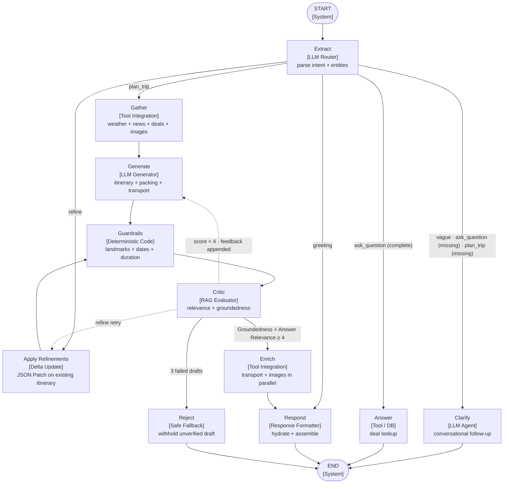

# Jalan — Conversational Travel Itinerary Planner

**Live app:** https://jalan-ai.vercel.app

A conversational travel planning assistant that turns natural-language requests into full day-by-day itineraries with live weather, real points flight deals, transport routing, packing lists, daily Google Maps route links, deterministic safety checks, and a RAG Triad LLM-as-a-judge self-correction loop — all powered by LangGraph and a hybrid Gemini model configuration.

_"jalan" means "to walk" or "to travel" in Indonesian._

Built with Next.js 14, LangChain/LangGraph, PostgreSQL, Clerk auth, the Seats.aero Partner API, OSRM (Open Source Routing Machine), and Nominatim geocoding.

---

## What it does

Users chat with **Jalan**, a friendly travel companion that:

1. **Understands natural-language trip requests** — e.g. *"Tokyo in October"*, *"honeymoon in Thailand"*, *"2 week Japan trip in December"*, *"find any deal to Bangkok in January"*.
2. **Asks clarifying questions** when details are missing — dates, origin, budget, cabin, trip length. Handles vague messages gracefully with conversational follow-ups.
3. **Generates a full day-by-day itinerary** with:
   - Real weather forecast from Open-Meteo.
   - Live destination news and events (Gemini web search grounding).
   - High-quality landmark images for each day from 3 image sources (Wikimedia Commons, Openverse, Pexels) — scored for metadata-aware relevance, filtered for dimensions and bad patterns, deduplicated, with destination image fallback so every day has an image.
   - A "Getting Around" section with local transit tips.
   - Per-day transport notes (walking/transit guidance with real times).
4. **Plans transport between every stop** — a dedicated transport agent geocodes each landmark and uses OSRM to get real walking/driving times, then recommends the best mode (walk, transit, ride-share) per leg, plus city-specific transit tips and cost estimates. Handles generic transit terms (MTR, Subway, JR) intelligently. Includes retry logic for Nominatim rate-limiting on long trips.
5. **Searches live award flight deals** via the Seats.aero Partner API — returns the top 5 lowest-mileage options, diversified by origin city, with duration, stops, taxes, and direct airline booking links. Supports country-level searches (e.g. "Japan" matches NRT/HND/KIX) with broadened date ranges.
6. **Provides daily Google Maps route links** — each day's landmarks are turned into a clickable Google Maps directions URL with highlight summaries (e.g. "Louvre → Eiffel Tower → Montmartre").
7. **Suggests a packing list** based on destination and weather.
8. **Lets users save trips** to a **One Stop** panel (sign-in gated) with a trip selector sidebar for multiple saved trips, to-dos, notes, deals, itinerary (with images), routes, transport, and packing list.
9. **Provides a section navigator** — a minimalist right-side rail (desktop) and floating button + drawer (mobile) that lets users jump to any section of the itinerary (Weather, Transport, Packing, Deals, Routes, individual days).
10. **Shares trips via link** — generates a public, read-only shareable URL that displays the full itinerary with all payload sections (weather, transport, packing, deals, routes) and its own section navigator. Links never expire.
11. **Refines existing itineraries via Delta Updates** — when a user asks to modify a previous plan (e.g. "swap day 2 lunch for a vegan spot", "make it shorter"), the agent uses a JSON Patch pattern: the LLM outputs only the specific edits needed, and a deterministic merger applies them surgically to the existing itinerary. Days the user was happy with are left byte-for-byte identical. This saves LLM output tokens, reduces latency, and avoids unwanted changes.
12. **Interactive daily route maps** — each day's route is rendered on an interactive Leaflet map (CARTO Voyager tiles) with numbered markers, walking/transit polylines, and auto-fit bounds. Airport/departure stops are always anchored as the final waypoint.
13. **One Stop collaboration** — per-day thumbs up/down feedback and comments alongside each day's itinerary, plus per-stop feedback, manual flight/hotel/train entries, and PDF document uploads for each saved trip. On desktop, each day renders in a 2-column layout with the itinerary on the left and the scrollable comment/voting panel pinned to the right; on mobile, comments are collapsed by default to prevent vertical bloat.
14. **Traveler Profile** — authenticated users can save global travel preferences (dietary restrictions, transport preference, airline alliance, general notes) that are injected into the LangGraph system prompt so every generated itinerary honors them.
15. **Mobile-optimized One Stop** — full-screen overlay on mobile with a native trip-selector dropdown, horizontally scrollable tabs with 44px touch targets, and no horizontal page scroll.

---

## Architecture

### Hybrid model configuration

The app uses a **hybrid Gemini model configuration** to balance quality and cost:

| Node | Model | Why |
|------|-------|-----|
| **generateItinerary** | `gemini-3.5-flash` | Main content — quality matters most (better prose, fewer hallucinations, near-perfect image placeholder compliance) |
| **criticNode** | `gemini-3.5-flash` | Quality evaluation — needs strong reasoning to catch hallucinations |
| **applyRefinements** | `gemini-3.5-flash-lite` | Delta Update — structured JSON patch output, surgical edits only |
| extractNode | `gemini-3.5-flash-lite` | Quick JSON entity extraction (~1s) |
| clarifyNode | `gemini-3.5-flash-lite` | Quick follow-up question (~1s) |
| answerNode | `gemini-3.5-flash-lite` | Quick factual answers (~1s) |
| generatePackingTips | `gemini-3.5-flash-lite` | Short list (~1s) |
| generateTitle | `gemini-3.5-flash-lite` | Quick title (~1s) |

Configurable via `CHAT_MODEL` (speed) and `QUALITY_MODEL` (quality) env vars. Cost: ~$15-20 per 1,000 trips.

### LangGraph conversation pipeline

The chat backend is a LangGraph state machine with the following nodes:



| Node | Type | Description |
|------|------|-------------|
| **Extract** | LLM Router | Uses `chrono-node` + LLM to parse destination, dates, duration, cabin, travelers, budget, and intent. Yearless dates resolve to the next future occurrence; explicit past travel dates are rejected. Enforces a 30-day duration cap. |
| **Clarify** | LLM Agent | Asks follow-up questions for missing fields and prompts users to replace invalid or past date ranges. |
| **Gather** | Tool Integration | Fetches weather (Open-Meteo), news (Gemini web search), live deals (Seats.aero), and destination images once. Retrieved context is retained across revisions. |
| **Generate** | LLM Generator | Creates the itinerary and packing list, then builds route links and transport guidance. Only this stage repeats when Critic requests self-correction. |
| **Apply Refinements** | Delta Update | Surgical editor for the `refine` intent. Uses `gemini-3.5-flash-lite` with structured outputs to generate a JSON patch (array of edits), then applies it deterministically via `mergeItineraryPatch()`. Bypasses Gather and Generate entirely — only the edited day changes, all other days remain byte-for-byte identical. |
| **Guardrails** | Deterministic Code | Verifies landmarks through Wikipedia, rejects past calendar dates, enforces the exact requested day count, and requires image placeholders. |
| **Critic** | RAG Evaluator | Runs an LLM-as-a-judge evaluation over `userQuery`, `retrievedContext`, and `draftItinerary`. Scores Context Relevance, Groundedness, and Answer Relevance from 1–5. Groundedness and Answer Relevance must both be at least 4. |
| **Enrich** | Tool Integration | Runs transport (OSRM routing + Nominatim geocoding) and image hydration (Wikimedia + Openverse + Pexels) concurrently via `Promise.all()`. Builds interactive route maps and Google Maps links. |
| **Answer** | Tool / DB | Handles deal-only lookups (e.g. *"find deals to Tokyo in December"*) with live Seats.aero search. |
| **Respond** | Response Formatter | Assembles the final markdown response with packing tips, transport notes, and image placeholders hydrated. |

#### Routing logic

The Extract node is an **LLM router** — it classifies the user's intent and checks for missing required fields (destination, dates). The routing is conditional:

| User says | Intent | Missing fields? | Routes to |
|-----------|--------|-----------------|-----------|
| *"Plan a 5-day trip to Tokyo in October"* | `plan_trip` | No | **Gather** (resolves to the next future October) |
| *"Plan a trip to Tokyo in October 2025"* | `plan_trip` | Invalid past date | **Clarify** (no itinerary is generated) |
| *"Plan a trip to Japan"* | `plan_trip` | Yes (no dates) | **Clarify** ("When are you thinking of visiting?") |
| *"Find deals to Bangkok in January"* | `ask_question` | No | **Answer** (deal lookup only, no itinerary) |
| *"What's the weather like in Bali?"* | `ask_question` | Yes (no dates) | **Clarify** ("When are you going?") |
| *"I want to travel somewhere"* | `vague` | — | **Clarify** (warm follow-up with example ideas) |
| *"Hi!"* | `greeting` | — | **Respond** (greeting back) |
| *"Make it shorter"* (after a plan) | `refine` | No | **Apply Refinements** (JSON Patch on existing itinerary — bypasses Gather/Generate) |

**Clarify is a conditional detour, not a prerequisite.** If the user provides enough information upfront (destination + dates), the flow skips Clarify and goes directly to Gather. After Clarify asks for missing info and the user replies, the next turn re-routes through Extract — which then sends the complete request to Gather.

The revision loop runs `Critic → Generate` (or `Critic → Apply Refinements` for the refine intent), so weather, news, flight, and image retrieval are not repeated. Critic reasoning is appended to graph state as generation feedback. After three unsuccessful drafts, Jalan returns a safe rejection instead of exposing an itinerary below the quality threshold.

### Delta Update (JSON Patch) for itinerary refinements

When a user asks to modify an existing itinerary (the `refine` intent), the agent uses a **Delta Update** pattern instead of regenerating the entire itinerary from scratch:

1. **Extract existing itinerary** — `extractExistingItinerary()` searches conversation history for the most recent assistant message with an itinerary payload.
2. **Generate a JSON patch** — `applyRefinements` calls `gemini-3.5-flash-lite` with structured outputs (Zod `ItineraryPatchSchema`) to produce an array of surgical edits:
   - `replace_stop` — swap a stop's name and/or description.
   - `add_stop` — insert a new stop under a time slot (morning/afternoon/evening).
   - `remove_stop` — delete a stop and its associated image placeholder.
   - `update_note` — update a stop's description without changing its name.
3. **Merge deterministically** — `mergeItineraryPatch()` splits the markdown into day blocks, applies edits to the target day only, and reassembles. Days not mentioned in the patch are returned byte-for-byte identical.

This saves LLM output tokens, reduces latency, and avoids altering days the user was already happy with. The refine path bypasses `Gather` and `Generate` entirely, routing directly: `Extract → Apply Refinements → Guardrails → Critic → Enrich → Respond`.

### Route optimization

The route optimizer (`src/lib/route-optimizer.ts`) reorders stops within each day to minimize travel time while respecting time-block ordering:

1. **Assigns time blocks** — morning (09:00–12:00), afternoon (13:00–17:00), evening (18:00–22:00). Night markets, rooftop bars, and sunset observatories are scheduled in the evening; museums and shrines in morning/afternoon; markets and breakfast spots in the morning.
2. **OSRM Table Service** — fetches pairwise travel times between all stops in a day.
3. **Nearest-neighbor + 2-opt** — optimizes within each time window, then concatenates morning → afternoon → evening sequences.
4. **Airport anchoring** — airport/departure stops are excluded from reordering and always appended as the final waypoint, so the map matches the itinerary's departure-day order.
5. **Updates route links** — Google Maps URLs are rebuilt with the optimized stop sequence.

### Transport agent

After the itinerary is generated and route links are extracted, a dedicated transport agent (`src/agents/transport.ts`) runs to provide real-world transport guidance:

1. **Geocodes each landmark** via Nominatim (OpenStreetMap, free, no API key) with two-tier validation:
   - **Tier 1:** display name contains the city → accept (in-city landmark).
   - **Tier 2:** within 200km of the city center → accept (day-trip destination like Mount Rainier from Seattle, Versailles from Paris).
   - **Otherwise:** reject (wrong city/country).
   - Results are cached persistently in PostgreSQL (`geocodedLocations` table) via Drizzle ORM, with cache validation on reads — stale/wrong entries are deleted and re-geocoded automatically.
2. **Gets real walking and driving times** between consecutive stops via OSRM (free, no API key).
3. **Recommends the best transport mode per leg** based on distance:
   - Under 15 min walk → "Walk"
   - 15-25 min walk → "Walk" (if driving would be 8+ min due to traffic)
   - Short drive but long walk → "Transit/Ride-share"
   - Over 5km → "Transit/Ride-share"
   - Otherwise → "Transit" with a balanced note
4. **Handles generic transit terms** — when the LLM uses terms like "MTR", "Subway", "JR", "Train" as stop names, the agent recognizes them and labels the leg as a transit ride (with the appropriate mode emoji) instead of trying to geocode them as walkable destinations. Time-slot headings (🌅 Morning:, 🌞 Afternoon:, 🌙 Evening:) are also filtered out using Unicode-aware regex so they never become waypoints.
5. **Generates city-specific transit tips** via LLM — which transit pass/card to buy, best navigation/ride-share app, cultural tips, and when to walk vs. take transit.
6. **Estimates transport costs** — markdown table with day pass, single ride, taxi base fare, ride-share, and weekly total.

All days are processed in parallel with in-memory and PostgreSQL caching to minimize Nominatim calls. Includes retry logic with exponential backoff on HTTP 429, and a 5-second fetch timeout on all external requests. When geocoding fails, shows a helpful "Take local transit from X to Y" message instead of an error.

### Interactive daily route maps

Each day's route is rendered on an interactive Leaflet map (`src/components/chat/DailyRouteMap.tsx`):

- **CARTO Voyager tiles** — modern, clean cartography (free, API key configured via `NEXT_PUBLIC_CARTO_API_KEY`).
- **Numbered markers** — each stop gets a blue circle with its order number.
- **Walking/transit polylines** — OSRM geometry is drawn as a blue line connecting stops.
- **Auto-fit bounds** — the map zooms to fit all stops with padding.
- **Airport anchoring** — airport/departure stops are always the final waypoint on the map, matching the itinerary order.

### Image hydration & relevance scoring

The image agent (`src/agents/destination-images.ts`) hydrates landmark and destination images before the itinerary reaches the user. Instead of taking the first API result, it queries multiple free image providers in parallel and selects the highest-scoring, most relevant candidate.

#### Image sources

Images are fetched concurrently from:

1. **Wikimedia Commons** — public domain / CC images.
2. **Openverse** — free CC images from Flickr, Wikimedia, Rawpixel, etc. (no API key).
3. **Pexels** — free stock photos (optional, requires `PEXELS_API_KEY`).

Wikipedia article-image lookup was removed because it could return less reliable results; the remaining providers are raced in parallel and the best valid candidate is chosen by score, with provider order used for ties.

#### Relevance scoring (`scoreImageRelevance`)

Each candidate is evaluated with `scoreImageRelevance(imageMetadata, term, originalRankIndex)`:

- `imageMetadata` is `{ title: string; tags: string[] }`.
- `term` is the normalized landmark or city name to match.
- `originalRankIndex` is the provider's 0-based result position, used to break ties.

The scorer builds a combined, deduplicated word set from both the image title and all tags, normalizes and stems every word, and then matches each term word to the candidate word set.

A term word and a candidate word are considered a match if one of the following is true, in order:

1. **Stem equality** (Porter stemming) — e.g. `gallery` matches `galleries`.
2. **Exact string equality** — e.g. `paris` matches `paris`.
3. **Long-word substring** — one word contains the other and both are ≥ 5 characters — e.g. `senso` is contained in `sensoji`.
4. **Levenshtein distance with a strict guard** — the edit distance is ≤ 2 **and** the ratio of the edit distance to the length of the longer word is ≤ 25%. This lets `colosseum` match `colosseo` (distance 2, 2/9 ≈ 22%) while correctly rejecting `austin` ↔ `austria` (distance 2, 2/7 ≈ 29%).

##### Scoring formula

For every term word that has a matching candidate word, the score is computed as the sum of per-word scores, normalized by the number of term words:

- **Base match value:** `1.0` for stem / exact / substring matches, `0.8` for Levenshtein matches.
- **Long-word bonus:** `+0.2` if the matched candidate word is ≥ 5 characters (landmarks are more distinctive than 3–4 letter words).
- **Provider-rank bonus:** `+ ((20 - min(originalRankIndex, 20)) * 0.015)` — earlier API results get a small tie-break boost, capped at rank 20.
- **Generic-word penalty:** if the term contains distinctive (non-generic) words but only generic words (`city`, `park`, `street`, `market`, `view`, `square`, `bridge`, `river`, `hill`, `island`, etc.) matched, the score is forced to `0`.
- **Minimum threshold:** candidates below `MIN_RELEVANCE_SCORE = 0.5` are rejected.

##### Safeguards and penalties

- **Sports-venue / cultural mismatch gate** — if the search term contains a cultural or religious word such as `shrine`, `temple`, `palace`, `garden`, `mosque`, `cathedral`, or `pagoda`, any candidate title or tags containing sports-venue terms (`stadium`, `baseball`, `arena`, `football`, `soccer`, `court`, `field`) is rejected with score `0`. This prevents, for example, a baseball-stadium photo being selected for Meiji Jingu Shrine.
- **Person / portrait penalty** — if the tags contain `person`, `portrait`, `woman`, `man`, `selfie`, or `face`, the final score is multiplied by `0.5` to prefer architectural and landscape shots over portraits.
- **Bad-pattern filtering** — before scoring, images are rejected if their title, tags, or URL contain obvious non-photos: `flag`, `emblem`, `logo`, `icon`, `seal`, `map`, `diagram`, `chart`, `graph`, `infographic`, `sign`, `plaque`, `statue` (for people), `pdf`, or `svg`.
- **Dimension & orientation checks** — very small, extremely tall/narrow, or oversized images are filtered. Landscape-oriented images are preferred over portrait.
- **URL cross-validation** — the image URL must contain at least one distinctive word from the term, which catches mismatched filenames (e.g. a URL containing `tamsui` for a `monkey forest` search).
- **Deduplication** — used image URLs are tracked across days, and the agent falls back to destination/city images and alternative term variants if a unique shot cannot be found.
- **Destination image fallback** — a city-level image is pre-fetched so every day has a valid image even when a specific landmark photo cannot be located.

#### Performance notes

- Provider calls run in parallel (`Promise.allSettled`) and are limited to 3 term variants per landmark (base, stripped suffix, `photo`) instead of the older ~12-variant list, cutting API calls by roughly 75%.
- Every external fetch uses a 5-second timeout (`AbortSignal.timeout(5000)`).
- Images and transport run concurrently in the post-Critic enrichment stage via `Promise.all()`.
- The core itinerary is streamed to the frontend before enrichment, so users see useful content sooner.

#### Testing image scoring

Run the deterministic scorer tests without consuming Gemini tokens or starting a server:

```bash
npx tsx scripts/test-image-scoring.ts
```

Covered assertions:

- `Colosseum` matches `Colosseo` (Levenshtein).
- `Senso-ji Temple` matches `Sensoji` (substring).
- `Uffizi Gallery` matches `Uffizi Galleries` (Porter stemming).
- `Austin` does **not** match `Austria` (length-normalized Levenshtein guard).
- Tags with `person`/`portrait`/`woman`/`man`/`selfie`/`face` halve the score.
- A stadium image is rejected for a shrine term (mismatch gate).

Run the full image spot tests for one or more landmarks:

```bash
npx tsx scripts/test-images.ts
npx tsx scripts/test-images.ts --landmarks "Colosseum" "Uffizi Gallery" "Meiji Jingu Shrine" "Senso-ji Temple"
```

### Live deal search (Seats.aero)

When the agent needs flight deals:

1. Searches the local PostgreSQL cache first.
2. If no cached deals match, calls the Seats.aero Partner API live:
   - Searches across major US gateways (JFK, LAX, SFO, ORD, DFW, etc.) if no origin is specified.
   - Returns up to 100 candidates, sorted by lowest mileage.
   - **Diversifies by origin city** — uses round-robin selection across unique origins so deals come from different hubs, not all from the same city.
   - Enriches the top 5 with trip details (duration, stops, layover, aircraft) from the Seats.aero `/trips/{id}` endpoint.
3. Each deal includes a direct booking link to the airline's website (Delta, American, United, JAL, etc.) via `src/lib/airline-booking.ts`.

### RAG Triad quality evaluation

Before an itinerary reaches the user, `src/lib/ragEvaluator.ts` runs an LLM-as-a-judge evaluation using three retained LangGraph state values:

- `userQuery` — the original request and constraints.
- `retrievedContext` — stringified weather, news, deals, images, extracted entities, and transport tool output.
- `draftItinerary` — the generated itinerary before response hydration.

The evaluator uses a strict Zod schema and returns typed 1–5 scores with reasoning for:

1. **Context Relevance** — whether retrieval was useful for the request.
2. **Groundedness / Faithfulness** — whether itinerary claims are supported and free of hallucinated locations, events, transit, and schedules.
3. **Answer Relevance** — whether the draft follows the requested destination, dates, interests, traveler count, cabin, and duration.

Groundedness and Answer Relevance must both score **4 or 5**. Lower scores route back to Generate with the judge's reasoning appended as feedback. Gemini structured-output parsing is retried inside the evaluator without repeating external retrieval.

### Hallucination and date guardrails

- **Wikipedia landmark verification** — every `![IMAGE: ...]` placeholder in the itinerary is checked against Wikipedia's search API. Unverified landmarks are flagged. Includes retry logic with exponential backoff on HTTP 429 rate-limiting, and fails open (assumes landmark is real) after all retries are exhausted.
- **RAG Critic** — compares the original request, raw tool context, and draft using strict structured output; low Groundedness or Answer Relevance triggers self-correction.
- **Past-date rejection** — explicit past travel dates never enter Gather; yearless dates are normalized to the next future occurrence.
- **Generated-date scan** — Guardrails reject past ISO or written calendar dates in drafts, preventing stale events from reaching users.
- **Exact duration check** — inclusive date math uses `duration - 1`, and the number of day headings must match the requested trip length.
- **Itinerary generator prompt** — instructed to only include real, well-known attractions, future events, and specific station names (e.g. "Tsim Sha Tsui MTR Station" not "MTR").
- **Route link filtering** — the Google Maps route builder filters out generic words (morning, afternoon, hotel) and transit-mode names so only real places become waypoints.
- **Image deduplication** — the image hydration agent tracks used URLs and tries alternatives before falling back to the destination image.
- **30-day duration cap** — prevents absurd requests like "2 years" from generating 730+ day itineraries. The cap is enforced in extractNode, generateItinerary, and the prompt tells the LLM to mention it naturally in the intro.

### Global destination support

The agent works for any destination worldwide — not just a fixed set of cities. Lookup tables (`AIRPORT_NAMES`, `CITY_MAP`, `WEATHER_CITIES`, `WIKIPEDIA_CITIES`, `CITY_AIRPORTS`) cover 70+ global destinations across Asia, Europe, Middle East, Latin America, Oceania, and Africa. For destinations not in the lookup tables, the agent falls back to using the city name directly for weather geocoding (Open-Meteo), news search (Gemini), and image lookups.

### One Stop panel

A sign-in-gated modal accessible from the left sidebar that lets users:

- **Save** any assistant response (deals, itinerary, packing list, route links, transport plan).
- **Duplicate prevention** — server-side and client-side checks prevent saving the same trip twice (by conversationId or destination + dates).
- **View saved trips** — on desktop, a trip selector sidebar lists all trips; on mobile, a native `<select>` dropdown at the top.
- **Manage to-dos** — add, check off, and delete tasks per trip.
- **Write notes** — free-form notes per trip.
- **Per-stop collaboration** — thumbs up/down feedback and comments on individual landmarks, persisted per saved trip.
- **Flights & Docs** — manual flight/hotel/train/car entries with confirmation codes, plus PDF document uploads (e-tickets, vouchers) stored as base64 data URLs.
- **Interactive route maps** — each day's route is rendered on a Leaflet map with CARTO Voyager tiles.
- **Copy trip summary** — copies everything to clipboard.
- **Delete trips** — organized copy + delete buttons in each trip card header.
- **Itinerary images** — the itinerary tab renders images inline with proper styling.
- **Mobile-optimized** — full-screen overlay on mobile (100vw x 100dvh), horizontally scrollable tabs with 44px touch targets, no horizontal page scroll, responsive form grids.
- **Persist** — saved trips are stored in PostgreSQL (signed-in users) or `localStorage` (guests).

---

## Tech stack

- **Frontend**: Next.js 14 App Router, React, TypeScript, Tailwind CSS, SWR, Clerk auth, Leaflet (interactive maps)
- **Backend**: Next.js Route Handlers (Node runtime), Vercel serverless functions
- **AI**: LangChain + LangGraph, Google Gemini (hybrid: `gemini-3.5-flash` for quality, `gemini-3.5-flash-lite` for speed + Delta Updates)
- **Flight deals**: Seats.aero Partner API (live search + trip details)
- **Transport routing**: OSRM (free walking/driving times + Table Service for route optimization) + Nominatim (geocoding with two-tier validation + PostgreSQL cache)
- **Maps**: Leaflet + CARTO Voyager tiles (modern cartography, API key configured)
- **Weather**: Open-Meteo (forecast + long-range climate projections)
- **Images**: Wikimedia Commons + Openverse + Pexels (optional, 3 sources), with metadata-aware relevance scoring and destination fallback
- **News**: Google Gemini web search grounding
- **Date parsing**: chrono-node
- **Database**: PostgreSQL + Drizzle ORM (for cached deals, conversation history, saved trips, geocoded locations)
- **Auth**: Clerk (sign-in/sign-up, anonymous sessions)
- **Deployment**: Vercel

---

## Key features

### Conversational chat
- Natural-language trip planning with follow-up questions.
- **Refine/follow-up via Delta Updates** — ask to modify an existing itinerary (e.g. "swap day 2 lunch for a vegan spot", "make it shorter") and the agent generates a JSON patch of surgical edits, then applies them deterministically. Only the edited day changes; all other days remain byte-for-byte identical. Saves tokens and avoids unwanted changes.
- Vague message handling — asks warm, conversational follow-ups with example ideas.
- Context-aware loading statuses (e.g. *"Checking the weather..."*, *"Looking for deals..."*).
- Conversation history with dynamic titles and delete.
- Persistent conversations across sessions (for signed-in users).
- Gemini-style sidebar with New trip, One Stop, and recent conversations.
- Closable sign-in prompt that appears when a guest sends their first message.
- Clickable Jalan logo navigates to home page.

### Live flight deals
- Top 5 lowest-mileage award deals from Seats.aero.
- **Country-level search** — saying "Japan" matches all Japanese airports (NRT, HND, KIX) via country-to-airport-code mapping.
- **Broadened date ranges** — when a user says "December" without a specific date, searches the entire month across any year. For specific dates, broadens by +/- 7 days to catch nearby deals.
- **Diversified by origin city** — round-robin selection across multiple US gateways when no origin is specified.
- Each deal shows: origin → destination, airline, cabin, date, points, taxes, duration, stops.
- Clickable cards that link directly to the airline's booking page.

### Transport & getting around
- **Live routing** — real walking and driving times between every itinerary stop via OSRM.
- **Best mode per leg** — recommends walk, transit, or ride-share based on actual distance.
- **Generic transit term handling** — recognizes MTR, Subway, JR, Train, Bus, Tram, Ferry, Taxi and labels them as transit legs instead of trying to geocode them.
- **City transit tips** — which pass/card to buy, best apps, cultural tips (AI-generated).
- **Cost estimates** — day pass, single ride, taxi, ride-share, and weekly total.
- Green-themed card in the chat with transit tips and cost estimates.

### Daily route links & interactive maps
- Each day's landmarks are extracted and turned into a Google Maps directions URL.
- **Highlight summaries** — shows the key stops (e.g. "Louvre → Eiffel Tower → Montmartre").
- **Interactive Leaflet map** — each day's route is also rendered on an interactive map (CARTO Voyager tiles) with numbered markers, walking/transit polylines, and auto-fit bounds. Airport/departure stops are always anchored as the final waypoint.
- **Route optimization** — stops within each day are reordered via OSRM Table Service + 2-opt to minimize travel time while respecting morning → afternoon → evening ordering.
- Clickable "Daily Routes" card in the chat and in the One Stop panel.

### Section navigator
- **Desktop**: minimalist right-side rail listing all itinerary sections (days, weather, transport, packing, deals, routes) as clean text links.
- **Mobile**: floating button (bottom-right) opens a slide-out drawer with the same section list.
- Click any section to jump directly to it with smooth scroll and header offset.
- Also available on shared trip pages.

### Share trip link
- Generate a public, read-only shareable URL for any itinerary.
- The shared page displays the full itinerary with all payload sections (weather, transport, packing, deals, routes) and its own section navigator.
- Links are stored server-side in PostgreSQL and never expire.
- "Share" and "Save to One Stop" buttons appear at the bottom of each assistant response, after all payload sections.

### Guardrails
- Wikipedia landmark verification.
- RAG Triad evaluation with a 4/5 Groundedness and Answer Relevance threshold.
- Past-date rejection and generated-itinerary date scanning.
- Exact requested-duration enforcement.
- Route builder filtering and image deduplication.
- 30-day maximum trip duration.

### One Stop panel
- Sign-in-gated modal — full-screen overlay on mobile, centered 95vw x 90vh on desktop.
- Save deals, itinerary (with inline images), packing list, transport plan, and routes.
- **Duplicate prevention** — server-side and client-side checks by conversationId or destination + dates.
- **Trip selector** — sidebar on desktop, native `<select>` dropdown on mobile.
- **Per-stop collaboration** — thumbs up/down feedback and comments on individual landmarks.
- **Flights & Docs** — manual flight/hotel/train entries + PDF document uploads.
- **Interactive route maps** — Leaflet maps with CARTO Voyager tiles per day.
- To-do list and notes per trip.
- Copy-to-clipboard and delete buttons organized in each trip card header.
- PostgreSQL persistence (signed-in) or localStorage (guests).

### Mobile-optimized
- **One Stop panel** — full-screen overlay (100vw x 100dvh) on mobile, native trip-selector dropdown, horizontally scrollable tabs with 44px touch targets, responsive form grids, no horizontal page scroll.
- No horizontal scroll — all content fits within the viewport.
- Images and tables scroll within their containers, not the page.
- Auto-scroll to top when itinerary finishes generating.
- Responsive layout with mobile sidebar drawer.

---

## API surface

- `POST /api/chat` — streaming chat endpoint (SSE) that runs the LangGraph conversation pipeline.
- `GET /api/chat/conversations` — list saved conversations for the current user.
- `DELETE /api/chat/conversations/[id]` — delete a conversation.
- `GET /api/chat/history` — load message history for a conversation.
- `POST /api/chat/merge-session` — merge anonymous session into user account on sign-in.
- `GET /api/saved-trips` — list saved trips for the current user.
- `POST /api/saved-trips` — create a saved trip (with duplicate detection by conversationId or destination + dates).
- `PATCH /api/saved-trips/[id]` — update trip todos, notes, feedback, flight info, documents.
- `DELETE /api/saved-trips/[id]` — delete a saved trip.
- `POST /api/share` — create a shareable link for a conversation's latest itinerary (server-side storage, never expires).
- `GET /api/share/[id]` — fetch a shared trip by ID (public, no auth required).
- `GET /api/deals` — paginated cached deals (legacy dashboard support).
- `POST /api/itinerary` — on-demand itinerary generation (legacy).
- `POST /api/booking-strategy` — booking strategy agent (legacy).
- `POST /api/logistics-check` — logistics check agent (legacy).
- `POST /api/email-itinerary` — email itinerary (legacy).
- `GET /api/cron/email-deals` — daily digest cron (legacy).

---

## Data sources

- **Seats.aero Partner API** — real award availability, trip details (duration, stops, aircraft).
- **OSRM** — real walking and driving routes between landmarks (free, no API key).
- **Nominatim / OpenStreetMap** — geocoding of landmark names to coordinates (free, no API key).
- **Open-Meteo** — destination weather forecast + long-range climate projections.
- **Wikimedia Commons** — public domain / CC landmark images (deduplicated).
- **Wikipedia** — landmark verification via search API; article lead images are no longer used as an image source.
- **Openverse** — free CC images from Flickr, Wikimedia, Rawpixel, etc. (no API key).
- **Pexels** — free stock photos (optional, requires `PEXELS_API_KEY`).
- **Google Maps** — daily route directions links (no API key required, uses public URL format).
- **CARTO Voyager** — modern map tiles for interactive Leaflet route maps (free within fair use, API key configured via `NEXT_PUBLIC_CARTO_API_KEY`).
- **Google Gemini** (via LangChain) — chat, itinerary generation, Delta Updates (refine), transport tips, critic, and reasoning.
- **Clerk** — authentication and user management.

---

## Project structure

```
src/
  agents/
    conversation-graph.ts    # LangGraph state machine (extract → gather → generate → guardrails → RAG critic → respond)
    refine-itinerary.ts      # Delta Update node: JSON Patch generation + deterministic mergeItineraryPatch reducer
    itinerary-guardrails.ts  # Wikipedia landmark verification + Google Maps route link builder
    transport.ts             # Transport agent: OSRM routing + Nominatim geocoding (two-tier validation) + LLM transit tips
    destination-images.ts    # Image hydration: Wikimedia + Openverse + Pexels, with metadata-aware relevance scoring
    weather.ts               # Open-Meteo forecast + climate projections
    news-search.ts           # Destination news search (Gemini web search grounding)
    graph.ts                 # Itinerary graph for deal modal (architect → critic)
    ...
  lib/
    route-optimizer.ts       # OSRM Table Service + 2-opt route optimization with time-block scheduling
    seatsaero.ts             # Seats.aero live search + trip details + deal diversification
    airline-booking.ts       # Airline-specific booking URL builder
    chat-state.ts            # Shared types + ItineraryPatchSchema (Zod) for Delta Updates
    chat-db.ts               # Conversation persistence
    ai-provider.ts           # LLM model configuration (hybrid: speed + quality models)
    ragEvaluator.ts          # Typed RAG Triad LLM-as-a-judge evaluation
    airports.ts              # Airport code/name mappings (70+ global destinations)
    city-map.ts              # IATA → city/country mappings (70+ entries for news search)
    airlines.ts              # Airline code → name/description mappings
    ...
  components/
    chat/
      ChatPage.tsx           # Main chat UI with sidebar, messages, section navigator, One Stop panel
      OneStopPanel.tsx       # Sign-in-gated modal: saved trips, to-dos, notes, collaboration, flights & docs
      DailyRouteMap.tsx      # Interactive Leaflet map (CARTO Voyager tiles) with numbered markers + polylines
    SplashRedirect.tsx       # Redirects old domain to jalan-ai.vercel.app
    WalkersIcon.tsx          # Custom walking figure logo
    AuthProvider.tsx         # Clerk provider wrapper
  app/
    api/
      chat/route.ts          # Streaming chat endpoint (SSE)
      chat/conversations/    # Conversation CRUD
      chat/history/          # Message history
      saved-trips/route.ts   # Saved trip CRUD with duplicate detection
      share/route.ts         # POST: create shareable trip link
      share/[id]/route.ts    # GET: fetch shared trip (public, no auth)
      ...
    share/[id]/page.tsx      # Public read-only shared trip page with section nav
  db/
    schema.ts                # Drizzle schema: flights, deals, conversations, messages, shared_trips, geocoded_locations
scripts/
  smoke-test.ts              # Local/production smoke tests (46 assertions, including date safety and exact duration)
  test-date-normalization.ts # Deterministic past-date and inclusive-duration regression tests
  test-rag-evaluator.ts      # Structured RAG evaluator test with dummy retrieved context
  test-refine-patch.ts       # Delta Update merger test — asserts Days 1 & 3 unchanged when editing Day 2
  test-route-optimization.ts # OSRM Table Service + 2-opt route optimization test (Paris fixture)
  test-seattle-geocode.ts    # Geocoding validation test (day-trip destinations within 200km)
  test-images.ts             # Local image testing without consuming Gemini tokens
```

---

## Setup

1. **Install dependencies:**
   ```bash
   npm install
   ```

2. **Configure environment variables** (see `.env.example`):
   - `GEMINI_API_KEY` — Gemini API key for LLM + news search grounding.
   - `SEATS_AERO_API_KEY` — Seats.aero Partner API key.
   - `DATABASE_URL` — PostgreSQL connection string.
   - `NEXT_PUBLIC_CLERK_PUBLISHABLE_KEY` + `CLERK_SECRET_KEY` — Clerk auth keys.
   - `CHAT_MODEL` — optional, defaults to `gemini-3.5-flash-lite` (speed-critical nodes).
   - `QUALITY_MODEL` — optional, defaults to `gemini-3.5-flash` (quality-critical nodes).
   - `PEXELS_API_KEY` — optional, enables Pexels as a 4th image source.
   - `NEXT_PUBLIC_CARTO_API_KEY` — optional, enables authenticated CARTO Voyager map tiles (free within fair use).

3. **Run the database migration:**
   ```bash
   npm run db:push
   ```

4. **Start the dev server:**
   ```bash
   npm run dev
   ```

5. **Build for production:**
   ```bash
   npm run build
   ```

6. **Deploy to Vercel:**
   ```bash
   npx vercel --prod
   npx vercel alias <deployment-url> jalan-ai.vercel.app
   npx vercel alias <deployment-url> flight-deals-dashboard.vercel.app
   ```

7. **Run local and production smoke tests:**
   ```bash
   npx tsx scripts/smoke-test.ts --local
   npx tsx scripts/smoke-test.ts
   ```
   The suite verifies deals, logistics, images, routes, transport, Wikipedia landmarks, exact itinerary duration, absence of past dates, and rejection of explicit past-date requests. Add `--skip-chat` to avoid Gemini usage when testing non-chat APIs.

8. **Run focused date and RAG tests:**
   ```bash
   npx tsx scripts/test-date-normalization.ts
   npx tsx scripts/test-rag-evaluator.ts
   npx tsx scripts/test-refine-patch.ts
   npx tsx scripts/test-route-optimization.ts
   ```
   `test-refine-patch.ts` verifies the Delta Update merger: mocks a 3-day itinerary, applies a "swap day 2 lunch" patch, and asserts Days 1 and 3 are byte-for-byte identical. `test-route-optimization.ts` tests OSRM Table Service + 2-opt with a Paris fixture (Louvre, Sacré-Cœur, Musée d'Orsay).

9. **Run local image tests** (without consuming Gemini tokens):
   ```bash
   npx tsx scripts/test-images.ts
   npx tsx scripts/test-image-scoring.ts
   ```
   `test-images.ts` fetches images from the 3 providers and validates quality. `test-image-scoring.ts` runs deterministic assertions for stemming, Levenshtein, portrait penalties, and the sports/cultural mismatch gate.

---

## Highlights

- Built a **conversational travel planner** powered by a LangGraph multi-agent loop (extract → gather → generate → guardrails → RAG critic → respond) that turns natural-language requests into full itineraries.
- Configured a **hybrid Gemini model setup** — `gemini-3.5-flash` for quality-critical nodes (itinerary generation, critic) and `gemini-3.5-flash-lite` for speed-critical nodes (extraction, clarification, answers) — balancing quality and cost (~$15-20 per 1,000 trips).
- Added a **refine/follow-up feature via Delta Updates (JSON Patch)** — when a user asks to modify a previous plan, the agent generates a JSON patch of surgical edits using `gemini-3.5-flash-lite` with structured outputs, then applies them deterministically via `mergeItineraryPatch()`. Only the edited day changes; all other days remain byte-for-byte identical. Saves LLM tokens, reduces latency, and avoids unwanted changes. Bypasses Gather and Generate entirely.
- Added a **transport agent** that geocodes every itinerary stop via Nominatim (with two-tier validation: in-city by display name + day-trip by 200km radius, persistent PostgreSQL caching, retry logic for rate-limiting), gets real walking/driving times via OSRM, recommends the best transport mode per leg, handles generic transit terms (MTR, JR, Subway) and filters time-slot headings (🌅 Morning:, 🌞 Afternoon:, 🌙 Evening:) using Unicode-aware regex, and generates city-specific transit tips + cost estimates via LLM.
- Integrated **live Seats.aero award deal search** with trip-detail enrichment (duration, stops, aircraft), direct airline booking links, **deal diversification by origin city** (round-robin selection across US gateways), and **country-level destination support** (e.g. "Japan" → NRT/HND/KIX) with broadened date ranges.
- Added a typed **RAG Triad LLM-as-a-judge pipeline** that scores Context Relevance, Groundedness, and Answer Relevance, requires 4/5 on the two user-facing quality metrics, and regenerates drafts using evaluator reasoning without repeating external retrieval.
- Added **hallucination and date guardrails** that verify landmarks against Wikipedia, reject past travel dates and stale calendar events, and enforce exact inclusive trip duration.
- Implemented **daily Google Maps route links** with highlight summaries by extracting landmarks from the itinerary and building clickable directions URLs — no API key required. Also added **interactive Leaflet maps** (CARTO Voyager tiles) with numbered markers, walking/transit polylines, and auto-fit bounds. Airport/departure stops are always anchored as the final waypoint.
- Added **OSRM-based route optimization** (Table Service + nearest-neighbor + 2-opt) that reorders stops within each day to minimize travel time while respecting morning → afternoon → evening time-block ordering.
- Built a **3-source image hydration agent** (Wikimedia Commons, Openverse, Pexels) with metadata-aware relevance scoring (Porter stemming, length-normalized Levenshtein distance, title + tag cross-validation), bad-pattern detection, dimension checks, deduplication, and destination image fallback so every day always has a high-quality landscape image.
- Added a **30-day duration guardrail** that caps absurd requests (e.g. "2 years") at 30 days, enforced in 3 places (extract, generate, prompt).
- Supports **70+ global destinations** with country-to-airport-code mapping for deal searches, and fallback to city name for weather, news, and images when IATA codes aren't in the lookup tables.
- Built a **share trip link feature** — generates public, read-only shareable URLs (stored server-side in PostgreSQL, never expire) that display the full itinerary with all payload sections and a section navigator.
- Built a **Gemini-style sidebar** with New trip, One Stop, and recent conversations as nav items, plus a closable sign-in prompt for guests. Logo is clickable to navigate home.
- Built a **One Stop panel** (sign-in-gated modal) with a trip selector (sidebar on desktop, dropdown on mobile), inline itinerary images, to-dos, notes, per-stop collaboration (thumbs up/down + comments), manual flight/hotel/train entries, PDF document uploads, interactive route maps, copy summary, and delete — all organized in clean card headers. Includes **duplicate trip prevention** (server-side + client-side by conversationId or destination + dates).
- Integrated **Clerk authentication** with anonymous session merging and sign-in-gated features.
- Added **vague message handling** — when users send unclear messages, the agent asks warm, conversational follow-ups with example trip ideas.
- Used **chrono-node** for flexible natural-language date parsing (e.g. *"in two weeks"*, *"next October"*, *"2 week trip"*).
- Optimized **mobile experience** — full-screen One Stop overlay (100vw x 100dvh), native trip-selector dropdown, horizontally scrollable tabs with 44px touch targets, no horizontal page scroll, auto-scroll to top on itinerary completion, responsive layout with mobile sidebar drawer, floating section navigator button.
- Implemented **local and post-deploy smoke tests** with 46 assertions covering date safety, exact duration, explicit past-date rejection, RAG-sensitive chat quality, routes, transport, images, deals, and Wikipedia landmark verification.
- Added **local image testing script** (`scripts/test-images.ts`) for testing image fetching without consuming Gemini tokens.
